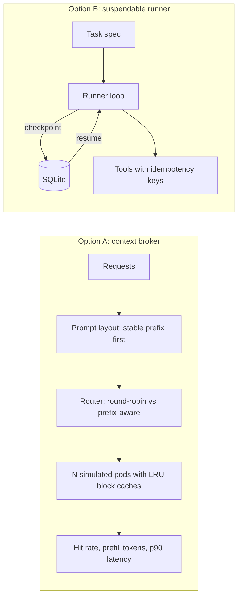
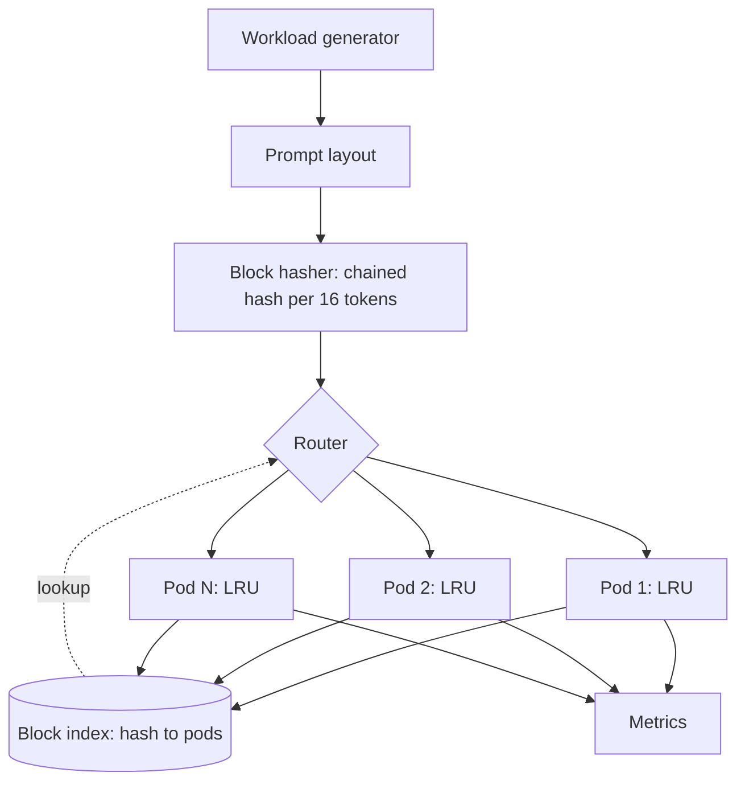
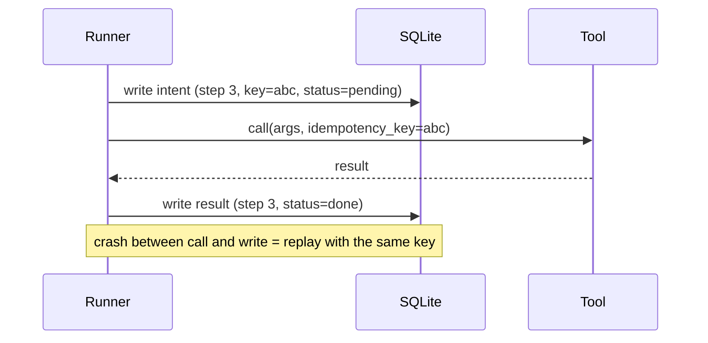

Four posts into the week, a pattern shows up. The research post says compaction should be a read over a lossless store. The systems post says your load balancer hides cache state from itself. The interview post says retrieval must respect permissions before ranking. The GitHub post says an agent runtime needs a first-class "pause".

Each is easy to nod along to. None of them is real until you've watched a number move. So this weekend, build one small thing where the numbers can move.

## The 5-minute version

Both options are deliberately small simulators or runners. No GPU, no cluster, no API key required (a fake "model" is fine).

**Key insight for Option A:** prefix caching is a property of how you *lay out the prompt* and *where you send it*, together. Fix only one and you leave most of the gain on the table. A prompt with a timestamp in the first line has no shareable prefix, no matter how clever the router.

**Key insight for Option B:** "resume" is only as good as your idempotency story. The checkpoint format is the easy part. The hard part is the tool call that was in flight when you paused.

Why a senior architect should care: these are the two places where agent platforms most often lose money and trust, one quietly (cache misses) and one loudly (duplicated side effects).



Pick one. Doing both in three hours means doing neither well.

---

## Option A: a prefix-aware context broker

### Goal

Build a simulator of an N-pod LLM fleet and compare routing strategies on a synthetic multi-tenant workload, then show how prompt layout changes the result.

### Why it's worth building

llm-d's published benchmark reports a very large gap between precise prefix-aware routing and cache-blind strategies on a workload designed to stress it. That's a vendor-adjacent, synthetic result. Building a toy version shows you *which parameters drive the gap*, so you can judge whether your own traffic looks like theirs.

### Requirements

- A workload generator: `T` tenants, each with a shared prefix of `P` tokens (system prompt plus tenant docs) and a variable user suffix.
- `N` simulated pods, each with an LRU cache of `C` blocks (16 tokens per block, chained block hashes so a block's key depends on everything before it).
- Three routers: round-robin, least-loaded, and prefix-aware (longest matching prefix, tie-broken by load).
- Metrics: token-level hit rate, prefill tokens computed, and a simple latency model (`prefill_tokens * t_prefill + queue wait`).
- A prompt-layout toggle: stable-prefix-first versus "timestamp and user ID first".

### Architecture



### Stack

Python 3.11, `numpy` for the arrival process, `matplotlib` for plots. Standard library `hashlib` for block hashes. Nothing else.

### Milestones

1. **Workload and hashing (40 min).** Generate token IDs as random integers (the content doesn't matter, only the sharing structure). Hash each 16-token block as `h = H(parent_hash, block_tokens)`. The chaining is the point: one different token early invalidates every later block, which is exactly why a timestamp on line one is so costly.
2. **Pods and LRU (30 min).** Each pod holds up to `C` block hashes in an `OrderedDict`. On a request, count the longest run of leading blocks present (a prefix hit is contiguous from the start), insert all blocks, evict from the cold end.
3. **Routers (30 min).** Round-robin and least-loaded are a few lines each. For prefix-aware, keep a global `dict[hash] -> set[pod]` updated on insert and evict, the same idea as the event-fed index in llm-d's KV-cache library. Score each pod by its leading-block match and subtract a load penalty `alpha * queue_len`.
4. **Sweep (40 min).** Hold the workload fixed. Vary `C` from "everything fits on every pod" down to "each pod holds one-sixth of the hot set". Plot hit rate per router against `C`.
5. **Break it on purpose (40 min).** Three experiments:
   - Move a per-request timestamp to the first line of every prompt. Watch hit rate collapse for *all* routers.
   - Make the index stale: apply evictions to it with a delay of `k` requests. Measure how much of the gain survives.
   - Raise `alpha` until hot pods appear. Plot p90 latency against `alpha`.

### What to look for

- At large `C`, the routers should barely differ. The gap opens when the hot set exceeds one pod's cache. That's the "cache demand is about 6x one pod" setup in the llm-d benchmark, and now you've seen why they chose it.
- There should be a sweet spot for `alpha`. Too low and you chase hits into a queue; too high and you've rebuilt round-robin.
- Staleness should cost you misses, not errors. Quantify it.

### Stretch goals

- Add a second tier (CPU memory) with a slower hit cost.
- Add a "RAG-shaped" tenant whose retrieved documents arrive in varying order, and see how prefix matching fails. Then try placing the stable parts first and sorting retrieved chunks by document ID.
- Add autoscaling: a new pod starts cold, scale-in drops its cache. Does your router fight the scaler?

---

## Option B: a task runner that can pause mid-thought

(Shorter alternative: the design is smaller, the discipline it teaches is bigger.)

### Goal

Build a tiny agent task runner with `suspend` and `resume`, backed by SQLite, where a crash at any point doesn't duplicate a side effect.

### Why it's worth building

Google's AX treats suspend and resume as first-class verbs, but its design doc doesn't spell out what a checkpoint contains or what a restore guarantees. Building the smallest honest version forces you to answer those questions yourself.

### Requirements

- A task is a sequence of steps; each step is "call model (stubbed), then maybe call a tool".
- Checkpoint after every model response and every tool result.
- Tools declare whether they are read-only, idempotent (with a key), or non-idempotent.
- `kill -9` the runner at a random moment; on restart, `resume` finishes the task with each side effect applied exactly once as far as the world can tell.

### Architecture



### Stack

Python 3.11, `sqlite3`, a fake "model" that returns scripted tool calls, a fake "payment" tool that records calls in a second SQLite file so you can count duplicates.

### Milestones

1. **Event log (30 min).** One table, append-only: `(task_id, seq, kind, payload, status)`. State is derived by replaying it. Resist the urge to store a snapshot blob first; a log tells you *why* you're where you are.
2. **Runner loop (30 min).** For each step: record intent, perform, record result. The intent record must be durable before the side effect starts.
3. **Idempotency (40 min).** The payment tool accepts a key and dedupes by it. Give the read-only tool no key. For the non-idempotent tool, decide: refuse to auto-resume and ask a human, or mark the step "unknown, needs review". Implement one and write down why.
4. **Chaos (40 min).** A loop that starts the runner, kills it after a random delay, restarts it, and at the end asserts the payment tool saw each key exactly once. Run 200 iterations.
5. **Suspend semantics (40 min).** Add `suspend`: finish the current atomic step, write a marker, exit. What happens to a step whose result hasn't arrived? Pick a rule and test it.

### What to look for

- The window between "tool call sent" and "result recorded" is where every bug lives. Count how often your chaos loop lands in it.
- Compare with what a workflow engine such as Temporal or Restate gives you for free, and note what you'd miss by hand-rolling.

### Stretch goals

- Branch a task from an earlier sequence number and run a different continuation (the evals use case).
- Add a lease so two runners can't both resume the same task.

---

## Build your own

If neither fits, scope your own three hours with this template. Copy it, fill it in, and stop planning once every line has an answer.

```
Goal (one sentence):
This week's idea it uses (cache-aware routing / query-time context
selection / permission-aware retrieval / suspendable tasks):
Inputs:
Outputs (the number or artifact I'll look at):
Must have (3 bullets max):
Nice to have:
Milestone 1 (by 1h):
Milestone 2 (by 2h):
Milestone 3 (by 3h):
How I'll know it works (one check I can run):
What I'm deliberately not building:
```

A good three-hour project has one number at the end that you didn't know at the start.

## Caveats on this week's sources

- llm-d's own repository now says the KV-cache indexer has moved into llm-d-router, so if you want to read the real thing, start there rather than in the older library. I haven't verified how the wire format or hashing scheme work, and neither of those is documented on the pages I read, so Option A's simulator uses its own chained-hash scheme and doesn't try to match vLLM's.
- The benchmark numbers from the systems post are the llm-d team's own, on a workload built to favour the technique. Your simulator's gap will be smaller or larger depending on your parameters, and that's the lesson.
- AX is alpha; Option B borrows its vocabulary, not its implementation.

Three hours is a generous budget for something small and finished. If you only get Option A's first three milestones working, that's a good Saturday, and if the weekend gets away from you, the project will still be here next week.
