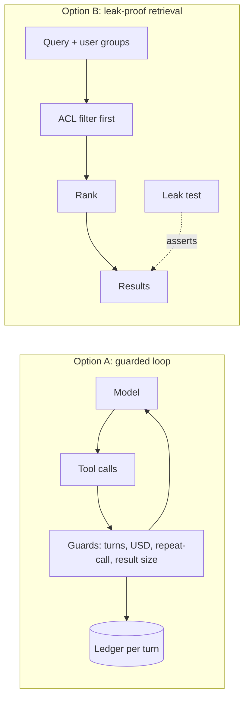
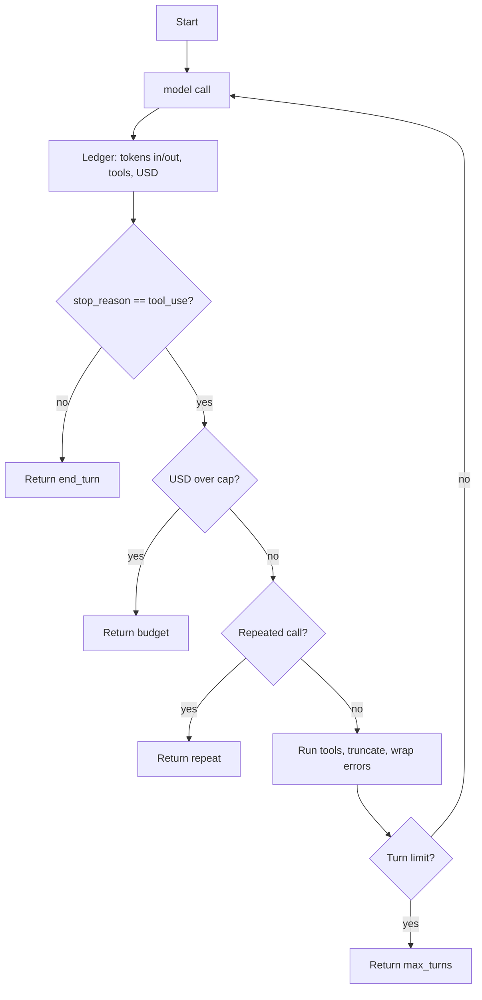
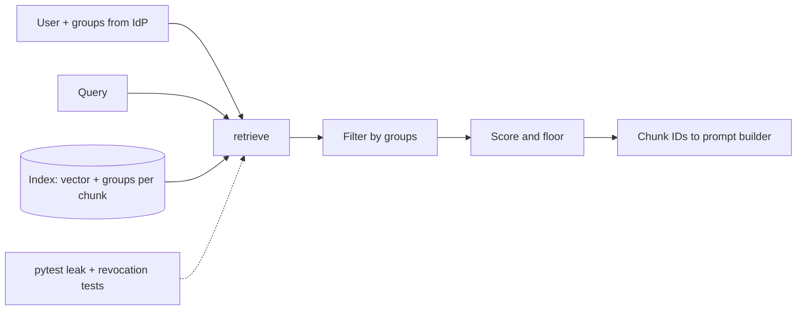

Two things from this week keep asking the same question. Monday's agent loop asks: who stops it when it misbehaves? Thursday's secure-assistant design asks: who stops it showing the wrong person the wrong document?

"The model will behave" is not an answer to either. Both are answered by ordinary code around the model, and ordinary code is testable. So this weekend you build one of those guards and prove it works.

## The 5-minute version

**What it is.** Pick one. Option A wraps a tool-calling loop in hard limits and a cost ledger. Option B enforces who-can-see-what inside retrieval, with a test that fails if anything leaks.

**The key insight.** Controls that live in the prompt are requests. Controls that live in code are guarantees. A turn cap, a budget, and a pre-ranking ACL filter don't depend on the model cooperating.

**Why a senior architect should care.** These are the two questions a platform or security review will ask first, and having the answer as a tested module beats having it as a slide. They also transfer to any provider: neither build assumes a specific model.



## Do it

Everything below runs on a laptop with no API key. That's deliberate: you're testing your guards, not the model.

### Option A: A tool-calling agent with a spend ledger and circuit breakers

**Goal.** A loop function you can drop in front of any provider, which stops on turn count, spend, or a stuck loop, and tells you exactly what each turn cost.

**Why it's worth building.** The loop is a plain `while stop_reason == "tool_use"`, as [Anthropic's tool-use docs](https://platform.claude.com/docs/en/agents-and-tools/tool-use/how-tool-use-works) describe it. The tutorial for it notes that a max-iteration limit is [essential for production but not shown](https://platform.claude.com/docs/en/agents-and-tools/tool-use/build-a-tool-using-agent). You're filling that gap.

**Requirements.**

- Stop after `max_turns` tool-use rounds.
- Stop when running spend crosses `max_usd`.
- Stop if the model issues the exact same tool call twice.
- Truncate any tool result above 4,000 characters.
- Send tool errors back with `is_error: true` instead of crashing.
- Return a status (`end_turn`, `max_turns`, `budget`, `repeat`) plus a per-turn ledger.

**Architecture.**



**Stack.** Python 3.11+, standard library only for the core; `pytest` for tests. Swap in a real SDK client in the stretch goals.

**Milestones.**

1. **(30 min) Skeleton and the fake model.** A model is just a function `(messages, tools) -> {stop_reason, content, usage}`. Write a `scripted(steps)` helper that replays canned responses. This is what makes the guards testable.
2. **(45 min) The loop and the ledger.**

```python
def run(model, tools, messages, g=Guards()):
    ledger, seen = Ledger(), set()
    for turn in range(1, g.max_turns + 1):
        resp = model(messages, tools)
        calls = [b for b in resp["content"] if b["type"] == "tool_use"]
        ledger.add(turn, resp["usage"], [c["name"] for c in calls], g)
        if resp["stop_reason"] != "tool_use":
            return {"status": resp["stop_reason"], "ledger": ledger, "content": resp["content"]}
        if ledger.usd >= g.max_usd:
            return {"status": "budget", "ledger": ledger}
        results = []
        for c in calls:
            key = (c["name"], json.dumps(c["input"], sort_keys=True))
            if key in seen:
                return {"status": "repeat", "ledger": ledger, "call": key}
            seen.add(key)
            try:
                out = json.dumps(tools[c["name"]](**c["input"]))[:4000]
                results.append({"type": "tool_result", "tool_use_id": c["id"], "content": out})
            except Exception as e:
                results.append({"type": "tool_result", "tool_use_id": c["id"],
                                "content": f"Error: {e}", "is_error": True})
        messages += [{"role": "assistant", "content": resp["content"]},
                     {"role": "user", "content": results}]
    return {"status": "max_turns", "ledger": ledger}
```

   `Guards` holds `max_turns`, `max_usd` and your model's per-token prices (look them up on the provider's pricing page; don't trust the example values). `Ledger.add` multiplies tokens by price and appends a row.

3. **(45 min) One test per breaker.** A scripted model that repeats one call must return `repeat`. One that never stops must return `max_turns`. One that finishes in two turns must return `end_turn` with a non-zero cost. If all three pass, you have a regression suite for the thing that most often goes wrong in production.
4. **(30 min) Make it fail on purpose.** Give a tool that returns 50,000 characters and confirm the truncation. Make a tool raise, and confirm the next turn sees `is_error`.
5. **(30 min) Look at the ledger.** Print it as a table. Input tokens should climb each turn. That growth is the cost curve to explain to anyone who asks why agents are expensive.

**Stretch goals.**

- Plug in a real client and run a two-tool task; compare real ledger totals with the provider's usage report.
- Run read-only tool calls from the same turn concurrently and mutating ones sequentially, as the [Agent SDK docs](https://code.claude.com/docs/en/agent-sdk/agent-loop) describe.
- Add a "near-repeat" detector (same tool, same path, different whitespace).

### Option B: Entitlement-aware retrieval with a leak test

**Goal.** A retrieval function that can't return a document the caller isn't entitled to, plus a test that proves it for every user and query you throw at it.

**Why it's worth building.** In Thursday's interview scenario, the hardest part was entitlements: the model is not an access control system, so the filter must sit in retrieval. Google's [RAG reference architecture](https://docs.cloud.google.com/architecture/gen-ai-rag-vertex-ai-vector-search) covers perimeter, keys and logging, but per-document entitlement is a design decision you make. This build makes it concrete.

**Requirements.**

- Each document carries a set of allowed groups.
- `retrieve(query, user_groups)` filters on groups before ranking and returns IDs.
- A relevance floor so weak matches return nothing rather than something.
- A leak test: for each (user, query) pair, no returned ID may be outside the user's groups.
- A "revocation" test: remove a group from a document, rebuild, and confirm the user loses access.

**Architecture.**



**Stack.** Python; bag-of-words cosine to start (no dependencies), then `sentence-transformers` or any embedding API plus FAISS or a managed vector store. If your corpus is big, use PySpark for the chunk-and-embed ingestion step, writing groups alongside each vector.

**Milestones.**

1. **(30 min) Toy corpus.** Fifteen short documents across three groups, with deliberate overlaps in vocabulary ("overdraft" appears in both a public policy and an exec-only memo).
2. **(40 min) Retrieval with the filter first.**

```python
def retrieve(query, user_groups, k=3, floor=0.1):
    q = vec(query)
    hits = [(cos(q, v), d) for d, v in INDEX if d["groups"] & user_groups]
    return [d["id"] for s, d in sorted(hits, key=lambda x: -x[0])[:k] if s >= floor]
```

3. **(40 min) The leak test.** Loop over users and queries, including adversarial ones that quote the secret document's exact title. Assert the intersection with forbidden IDs is empty.
4. **(30 min) Revocation.** Change a document's groups, re-index, re-run. Decide and write down how long a revocation may take to propagate, and make the test enforce that number.
5. **(40 min) Swap in real embeddings.** The leak test must still pass unchanged. If it doesn't, you filtered after ranking somewhere.

**Stretch goals.**

- Log every retrieval with user, query hash and returned IDs, ready for an audit.
- Add a canary document only one group can see, with a unique token; the leak test greps model outputs for that token.
- Compare filter-before-rank with filter-after-rank on recall and measure what you lose.

## Build your own

Copy this, fill it in, and set a 3-hour timer.

```
Goal (one sentence):
Which ideas from this week it uses (agent loop / guards / ACLs / cost):
Inputs:
Outputs:
Must-have (works without these = not done):
Nice-to-have:
Milestone 1 (by 45 min):
Milestone 2 (by 1 h 45):
Milestone 3 (by 2 h 45):
How I'll know it works (one test or one demo):
```

If your milestone 1 slips past an hour, shrink the goal, not the sleep.

Finished half a build? Honestly, that's a build. Skip a weekend whenever you need to, because the code will keep.
