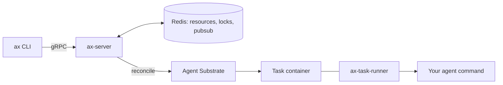

Most agent frameworks answer the question "how do I write the loop?" AX, Google's open-source agent runtime, skips that one entirely. Its question is: if you had a few million agent runs a day, each one untrusted code with a model attached, what would you build to run them?

The answer it gives looks a lot like Kubernetes. You write YAML, you `ax apply` it, you `ax get tasks`. Then it does one thing Kubernetes deliberately avoids: it refuses to store those tasks in etcd.

That decision is the reason to read this repo.

## What it is

[google/ax](https://github.com/google/ax) is Apache 2.0 licensed and written in Go. The README calls it a high-throughput, declarative orchestrator for agent workloads in a cluster, running on top of Agent Substrate, a separate Google project built with the GKE team. Google announced it in May 2026 as a [preview](https://cloud.google.com/blog/products/ai-machine-learning/agent-executor-googles-distributed-agent-runtime/) (the blog calls the runtime Agent Executor; the repo is AX). The README warns about "heavy development" and likely breaking changes. Treat it as a design to study, not a dependency to adopt.

Three resource types, all under `ax.io/v1alpha1`:

- **Task:** runs agent code in an isolated sandbox with CPU and memory limits.
- **Workspace:** pre-wires Git repos, MCP servers and skill packages.
- **Model:** the LLM configuration, with credentials from a Kubernetes secret.

Notice the split. The thing that changes per run (the task) is separate from the environment it needs (the workspace) and the brain it calls (the model). That's the same separation you'd want in any enterprise agent platform, and it falls out naturally from the manifest model.

## How it's put together

From `DESIGN.md`:

- **`ax-server`** exposes gRPC, validates manifests, takes distributed locks, reconciles directly against Agent Substrate and persists state.
- **Redis** holds the resource store, the locks and PubSub.
- **`ax-task-runner`** is the entrypoint inside each task container: it bootstraps the workspace, serves metadata and runs your agent command. It's a thin wrapper over a `runner` package that custom images can embed.
- **`WatchTask`** is a server-streaming RPC for status and condition changes. `SuspendTask` and `ResumeTask` checkpoint and restore.

## What to learn from it

**1. Don't put churn in your control plane's database.** The design doc says it plainly: storing millions of short-lived tasks as CRDs "pushes etcd past its comfort zone". If you've run a busy cluster you know the feeling. AX keeps the Kubernetes *ergonomics* (declarative manifests, `apply/get/describe/watch/delete`) but moves the high-churn state to Redis. It's a good reminder that "declarative" and "stored in etcd" are separate choices.

**2. Make pause a first-class verb.** `ax suspend` and `ax resume` sit next to `apply`. Agents wait on humans, on rate limits, on slow tools. A runtime that can park a task and free the compute is a different cost profile from one that holds a pod open. Google's blog also mentions trajectory branching from checkpoints, which would be handy for evals and "what if the agent had gone left", though the repo docs I read don't detail it.

**3. Keep the runner contract thin.** The agent is just a command run by a wrapper. That's how it stays harness-agnostic: the blog says it federates with ADK, LangGraph and A2A agents.

## What it doesn't tell you (yet)

This is the part to read slowly. `DESIGN.md` doesn't state:

- what a checkpoint contains, where it's stored, or what restore guarantees,
- Redis persistence settings or lock lease behaviour. Redis as the resource store means durability depends on how you run Redis, and you should find out before trusting it,
- the task state machine or what "conditions" mean,
- scheduling or placement policy, or the isolation boundary beyond "each task runs in its own container".

Google's blog also makes scale claims ("hundreds of millions" of agents, "millions of sub-second tool calls") with no benchmark attached. Those are design targets. If you were evaluating this for a platform, you'd want your own numbers: cold-start latency, resume latency after a checkpoint, and Redis behaviour under failover.

## When it fits, and when it doesn't

Look at it if you're building a multi-tenant agent platform on Kubernetes and want a reference for task/workspace/model separation. Skip adopting it for now if you need stability: it's alpha, with a warning to match.

If your agents are long-running workflows with strong retry semantics, compare it with a workflow engine (Temporal, Restate) before deciding. AX's pitch is sandboxed execution of arbitrary agent code; those engines' pitch is deterministic replay of your orchestration code. They overlap, but they're not the same thing.

## Do it (45 minutes)

You don't need a cluster for the useful part. A cluster is optional.

**Part 1: read like a reviewer (25 min)**

1. `git clone https://github.com/google/ax && cd ax`
2. Read `DESIGN.md`. Write down, in a scratch file, three things it doesn't specify (use the list above as a start, then find your own).
3. Open `pkg/apis/v1alpha1/` and list the fields of Task, Workspace and Model. Which fields would you want for cost attribution or per-tenant limits that aren't there?
4. Open `examples/task.yaml` and the `runner/` directory. Sketch the contract in your own words: what does the runner receive, and what does it owe back?

**Part 2: design the missing piece (10 min)**

On paper, define a checkpoint format for an agent task. What must be in it: conversation state, workspace filesystem, in-flight tool calls? What happens to a tool call that was mid-flight at suspend time? (Hint: this is the same idempotency problem durable-execution engines solve.)

**Part 3 (optional, 10+ min): run it**

If you have a cluster with Agent Substrate installed (the README's prerequisite is `kubectl get svc api -n ate-system`), follow the README: `go install github.com/google/ax/cmd/ax@latest`, `make deploy AX_IMAGE_REPO=<your-registry>`, then `ax apply -f examples/task.yaml`, `ax get tasks`, `ax suspend task <name>` and `ax resume task <name>`. There's also a `./demo.sh` for the full lifecycle. Without Substrate, skip it. Reading is the point today.

Done beats perfect: if you only got through the reading, you got most of the value, and tomorrow is another topic anyway.
