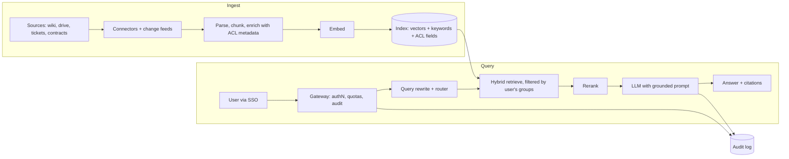

Most system design answers for "internal assistant" questions fail in the same place. The candidate draws a clean RAG pipeline, mentions a vector database, and then the interviewer asks: "A contractor leaves on Friday. What happens to the documents they could see?"

Silence. The pipeline was fine. The access model wasn't in the picture.

This post is a worked round for the **AI/Solution Architect** role, with a Google Cloud flavour. The question is written *in the style of* a platform-architect round. It's not a reported question from any company, and nothing here claims to be what Google asks. The framework carries over to any cloud.

## The question

> A global company with 50,000 employees wants an internal assistant that answers questions over its documents: wikis, drive files, tickets, contracts, and a few databases. Security has a veto. Finance wants a cost ceiling per user. You're the architect. Design it.

## ⏸ Pause — answer out loud for 10 minutes first

Set a timer. Talk, don't write. Record yourself if you can. The point is to find where you go quiet, because that's where the real round will go quiet too.

## A framework that fits in your head

Spend the first five minutes of any design round on four things, in this order:

1. **Clarify the job.** Question answering, search, or actions? Who are the users, and how bad is a wrong answer? A wrong answer about a holiday policy is annoying. A wrong answer about a contract clause is a problem.
2. **Pin the constraints.** Latency target, data residency, compliance regime, identity provider, budget per user per month.
3. **Draw the data path and the control path separately.** Data path: ingest, index, retrieve, generate. Control path: identity, permissions, audit, evaluation, cost.
4. **Name the three decisions you'd defend.** For this question they're the permission model, the retrieval design, and the capacity plan.

Say that structure out loud at the start. It tells the interviewer you won't wander.

## Model answer

### Clarify

I'd ask: read-only Q&A, or does it take actions? (Assume read-only for v1.) Which sources matter most for the first release? Which regions must data stay in? How fresh must answers be: minutes, or next day? Is there an existing identity provider with groups?

Then I'd state assumptions explicitly, because I'd be inventing numbers otherwise. For example: assume 20% of employees use it on a given day, a few queries each, with a daily peak around the start of working hours in each region. Those are my assumptions to be replaced by real telemetry, not facts.

### Architecture

On Google Cloud that maps to managed pieces such as Vertex AI for models, a vector/hybrid search service for the index, and Cloud Run or GKE for the gateway. But I'd say plainly that the pieces are interchangeable, and that the interesting decisions don't depend on vendor.

### Decision 1: the permission model

This is where the round is won or lost.

Three options, and I'd name all three:

- **Filter at query time using the user's groups against ACL metadata stored with each chunk.** Cheap and fast. The trap: ACLs change. Someone is removed from a group and the index still says they can read. So you need a change feed that updates ACL metadata far faster than you re-embed content.
- **Check permissions against the source system at answer time** for the top-k results. Always correct, adds latency and load on source systems, and some sources have no good "can this user read this" API.
- **Hybrid.** Fast filter on indexed ACLs, then a live check on the handful of documents that actually reach the prompt.

I'd pick the hybrid and say why: the index filter keeps retrieval quality honest (you don't retrieve things you'll throw away), and the live check closes the staleness window for the documents that matter. Then name the residual risk: derived data. If a summary of a restricted document gets cached or stored as "memory", it can outlive the permission. Don't cache answers across users unless the cache key includes the permission context.

### Decision 2: retrieval design

- **Hybrid search** (keyword plus vectors) because enterprise queries are full of ticket IDs, product codenames and acronyms that embeddings handle badly.
- **Chunking that respects structure.** Contracts by clause, wikis by heading, tickets as a thread. Carry the document title and path into each chunk.
- **Rerank** the top candidates before the model sees them. It's usually the cheapest quality gain per millisecond.
- **Citations as a first-class output.** Not decoration: they're how users catch the wrong answers, and how you debug.
- **"I don't know" is a feature.** Set a retrieval-confidence threshold, and test that it fires.

For multi-hop questions ("which vendors have contracts expiring that also have open incidents?"), I'd say plainly that single-shot RAG won't do it. Either route to a structured query tool over a database, or accept an agentic loop with a step budget. Say which, and why.

### Decision 3: capacity, latency and cost

Don't quote numbers you can't back. Instead, show the shape of the calculation:

- Tokens per query = system prompt + retrieved context + question + answer. Retrieved context usually dominates.
- Daily tokens = active users × queries × tokens per query. Multiply by the per-token prices *for the model you chose, from the current price page*. Then divide by users for the Finance number.

Levers, in the order I'd pull them:

1. **Shrink context.** Better reranking means fewer chunks, which is cheaper and often more accurate.
2. **Use prompt caching for the stable prefix.** On Vertex AI, Google's docs say implicit caching is on by default for all projects, gives a 90% discount on cached input tokens, and has no storage fee. Explicit caching does charge for storage time. Minimum cacheable sizes vary by model family (the page lists figures from 2,048 up to 6,144 tokens), so check the page for your model. The catch: it only helps if the stable part comes first in the prompt and requests with that prefix arrive close together.
3. **Route by difficulty.** A small, fast model for simple lookups; a larger one for synthesis. Measure the routing error before trusting it.
4. **Capacity mode.** Shared pay-as-you-go capacity can return rate-limit errors at peak, while reserved capacity buys predictability at a fixed cost. Which one fits depends on how spiky your morning peak is. I'd check the current provider docs for exact behaviour rather than quote it from memory.

For latency, budget it by stage: gateway and auth, retrieval, rerank, time to first token, then generation. Stream the answer. Users forgive a slow finish far more than a slow start.

### Evaluation and operations

- A golden set of real questions with expected source documents, built with the teams who own the content.
- Separate metrics for retrieval (did the right chunk come back?) and generation (did the answer stay faithful to it?). Mixing them hides which half broke.
- Online signals: thumbs, citation clicks, re-asks within a minute.
- Audit log of who asked what, which documents were retrieved, and which were cited. Security will want this on day one.
- Rollout in rings: one department, then a region, then everyone. Quality problems show up as department-specific jargon first.

### Failure modes worth naming

- **Stale ACLs** leaking content after access is revoked.
- **Prompt injection through documents.** A wiki page that says "ignore previous instructions". Treat retrieved text as untrusted data, and keep the assistant read-only in v1.
- **Index drift.** Source moved or deleted, answers still cite it.
- **Hot-topic cache stampedes** when a company announcement sends everyone to the same question at once.
- **Silent embedding model change** that makes old and new vectors incomparable.

## What top candidates add at this level

- They put the **permission model before the vector database**, unprompted.
- They separate **who owns what**: platform team owns the pipeline; content owners own freshness and the golden set. An assistant with no content owners decays.
- They **price it** with a formula and named assumptions, instead of a confident number.
- They state what they'd **cut for v1** and what would make them add it back.
- They end with a **rollout and rollback plan**, not just a diagram.

## One tip

When you draw, label arrows with *what travels on them* (user identity, ACL filter, citations). It's a small habit, and it forces the permission story to appear without you remembering to tell it.

## Practice (about 35 minutes)

1. Re-run your spoken answer, this time starting with the four-step framework. Compare the two recordings.
2. Write the cost formula on one page with your own assumptions, leaving prices as blanks to fill from the current price page.
3. Write the contractor-leaves-on-Friday story as three sentences: what changes in the source, how the index learns, and when the user's access actually ends.

If the second recording still wanders, that's useful information, not a verdict. Pick one section to tighten and leave the rest for another day.

Sources: [Vertex AI context caching overview](https://docs.cloud.google.com/vertex-ai/generative-ai/docs/context-cache/context-cache-overview).
