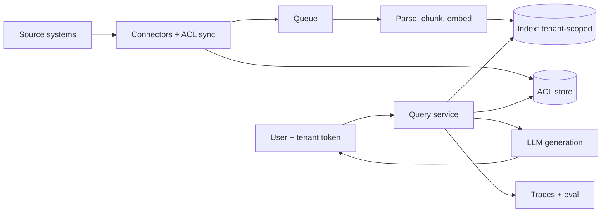

Most RAG demos have one user and one corpus. Most RAG interviews quietly add the thing demos skip: a second customer, and a rule that they must never see the first one's documents.

That single constraint reshapes the whole design. It's why this question keeps showing up in architect loops, and why a clean "embed, store, retrieve, generate" diagram only gets you through the first five minutes.

This drill is for the **AI/Solution Architect** role, with the company focus on Google. The question is *in the style of* what a cloud-provider architect loop asks. It isn't a reported question from any specific interview.

## The question

> A large enterprise software vendor wants an assistant inside its product. Each of its 2,000 customers (tenants) has their own documents: wikis, tickets, contracts, PDFs. Within a tenant, access follows existing permissions: an employee only gets answers from documents they could open themselves. Design the platform. Cover ingestion, retrieval, isolation, latency, cost and how you'd know it's working.

## ⏸ Pause: answer out loud for 10 minutes first

Set a timer. Talk, don't write. Draw on paper if you like. The point is to find where you go quiet; that's the part to study.

## A framework that fits in your head

Spend the first three minutes on requirements, not boxes. Four questions carry most of the weight:

1. **Tenant shape.** 2,000 tenants, but is the distribution flat or are three of them 90% of the data? Regulated tenants wanting their own keys or region?
2. **Permission model.** Who decides access: the source system (SharePoint, Drive, Confluence) or ours? How fast must a revoked permission take effect?
3. **Freshness.** Minutes, hours, next day?
4. **What does "good" mean?** Answer quality, citation accuracy, latency target, cost per question.

Then walk the pipeline in order: **ingest, index, retrieve, generate, evaluate**. At each stage, say what changes because of multi-tenancy. That sentence is what interviewers listen for.

## Model answer

**Ingestion.** Connectors pull documents and, separately, their permissions. Treat the ACL as first-class data with its own sync path, because it changes more often than the content. An event-driven pipeline (object store or webhook to a queue to workers) gives you freshness without batch windows. Google's own RAG reference architectures use this shape: data lands in Cloud Storage, Pub/Sub triggers a Cloud Run function, which calls an embeddings API and updates a vector index ([reference architecture](https://docs.cloud.google.com/architecture/gen-ai-rag-vertex-ai-vector-search)). It's a sensible baseline to name, and then you add the tenant dimension it doesn't cover.

**Isolation: pick a tier, don't pick one answer.** Three options, and a good architect offers all of them with a rule for choosing:

- *Shared index, tenant filter on every query.* Cheapest, scales to thousands of small tenants. The risk is a missing filter, so enforce it in one place the application can't bypass (the query service builds the filter from the signed token, never from request parameters).
- *Index or collection per tenant.* Stronger blast-radius story, easy deletion on offboarding, per-tenant tuning. Costs grow with tenant count and small tenants waste capacity.
- *Dedicated project or cluster per tenant.* For regulated customers who need their own encryption keys, region or audit boundary. Expensive; sell it as a premium tier.

My default: shared infrastructure with per-tenant namespaces for the long tail, and dedicated stacks for the handful that contractually need them. Google's guidance for its managed RAG options also leans on separate logical containers where strict isolation is required, but check the current limits of whichever managed service you propose. The docs I read list quotas that matter at 2,000 tenants, such as concurrent import limits and retrieval requests per minute, and they change.

**Permission-aware retrieval.** This is where weaker answers fall apart. Two approaches:

- *Pre-filter:* store each chunk's allowed principals (users, groups) as metadata and filter inside the vector search. Correct by construction, but group-heavy ACLs make the filter expensive, and nested groups need flattening at ingest.
- *Post-filter:* retrieve top-k, then check access against the source of truth. Always fresh, but you can end with fewer than k results, or none, so over-fetch and loop.

A pragmatic hybrid: pre-filter on a coarse, cached principal set for recall, then verify the final handful of chunks against the live ACL just before they enter the prompt. Revocation then takes effect at query time, not at the next sync. Say plainly that the second check costs latency and that you'd budget for it.

**Retrieval quality.** Hybrid retrieval (lexical plus dense) with a reranker, because enterprise queries are full of part numbers and names that embeddings blur. Send fewer, better chunks. Models use long contexts unevenly: in the original "Lost in the Middle" study, accuracy on multi-document QA dropped when the answer sat in the middle of the context, with GPT-3.5-Turbo's mid-position accuracy falling below its no-documents baseline ([paper](https://ar5iv.labs.arxiv.org/html/2307.03172)). That was older models; newer ones are better, so treat it as a reason to *measure* your own position sensitivity, not as a law.

**Generation.** Require citations to chunk IDs and have the service verify that each cited ID was actually in the prompt. It's a cheap check that catches fabricated sources. Stream the response; perceived latency matters more than total.

**Cost and latency.** The static prefix (system prompt, tool definitions, tenant instructions) is the same on every call, so put it first and use prompt caching. Gemini's API has implicit caching on by default for 2.5 and newer models, with minimum token thresholds that vary by model (4,096 for the newer Flash and Pro previews, 2,048 for 2.5), and the docs advise placing large reused content at the start of the prompt ([docs](https://ai.google.dev/gemini-api/docs/caching)). The page I read didn't state TTL or prices, so check those before putting a number in a design. Retrieved chunks vary per query, so they won't cache; that's another argument for sending fewer of them. Route easy questions to a smaller model.

**Evaluation and operations.**
- A per-tenant golden set is impractical at 2,000 tenants. Build a small shared set plus synthetic questions generated from each tenant's own documents, and sample real traffic with human review.
- Track retrieval recall, citation validity, answer groundedness, p95 latency and cost per question, sliced by tenant. Averages hide the tenant who's having a bad week.
- **Leak tests.** Seed canary documents in tenant A and run adversarial queries as tenant B on a schedule. A leak is a sev-1, so test for it like one.
- Noisy neighbours: per-tenant rate limits and ingestion quotas, so one tenant's 10-million-document import doesn't starve everyone.

## What top candidates add at this level

- **They name the failure that ends the company.** Cross-tenant leakage, and they say where it's prevented (one enforcement point, token-derived filters) and how it's detected (canaries).
- **They separate content sync from permission sync** and give a revocation SLA, not a hand-wave about "real-time".
- **They design for offboarding.** Delete a tenant's data and its embeddings, caches and logs within a stated window. Per-tenant keys make this easy; a shared index makes it a project.
- **They price it.** Embedding cost at ingest, storage per vector, and tokens per question, even as rough shapes. As a solution architect you'll be the one explaining the bill.
- **They push back on scope.** "Do all 2,000 tenants need the same quality tier?" is a better question than any diagram.
- **They know what the managed service does and doesn't do.** Quotas, regional availability and data residency are in the docs; read them before the interview, not after.

## One tip

Practise the permission-aware retrieval section until you can explain it in 90 seconds, including the trade-off between pre- and post-filtering. It's the part most candidates skip, and it's the part a real customer's security team will grill you on.

Rough edges are fine here. A first answer that wanders still teaches you more than reading three more articles, and a day you skip costs nothing.
