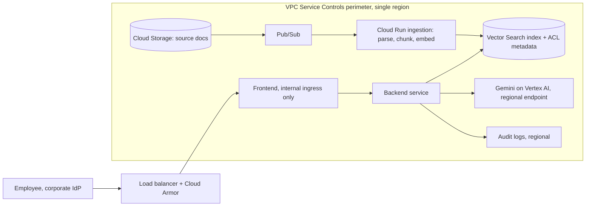

**Role: AI / Solution Architect. Company focus: Google (Cloud).**

Customer-facing architect interviews have a quirk. The question sounds like a design exercise, but the interviewer is quietly grading something else: can you take a vague business ask, surface the constraints the customer hasn't said out loud, and still land on something buildable?

Public question banks for this role cluster around a few shapes: secure enterprise Gemini integrations, RAG over internal documents, and agent security. The question below is **in the style of** those. It is not a reported Google question, and I'm not claiming it is.

## The question

> A retail bank wants an assistant that answers employees' questions over its internal policy and product documents, using Gemini on Google Cloud. Compliance requires that data stays in one region, that nothing can be copied out to services outside the bank's environment, and that employees only ever see documents they're already entitled to. Design it. You have 40 minutes with the customer's CISO and head of engineering in the room.

## ⏸ Pause — answer out loud for 10 minutes first

Seriously. Set a timer. Say it out loud, draw it on paper. Your first minute should be questions, not boxes. Then come back.

## A framework that keeps you honest

Five beats, in this order:

1. **Clarify and size.** Users, document count and churn, languages, expected questions per day, latency tolerance, and what a wrong answer costs.
2. **Constraints as design drivers.** Name the three here out loud: residency, exfiltration, entitlements. They decide the architecture before accuracy does.
3. **Data path.** Ingest, chunk, embed, index; then serve, retrieve, ground, generate.
4. **Control path.** Identity, network perimeter, keys, logging, evaluation.
5. **Failure and operations.** What breaks, how you'd know, what it costs.

## Model answer

**Clarify (2 minutes).** Ask: how many documents and how often do they change? Do entitlements live in one system or five? Is the answer a lookup ("what's the limit on X") or a judgement ("can we offer Y to this customer")? Judgement questions push you toward human review and citations. Also ask what the bank's definition of "copied out" is: model provider, logs, embeddings, and prompts all count.

**Architecture.** Google's own [RAG reference architecture](https://docs.cloud.google.com/architecture/gen-ai-rag-vertex-ai-vector-search) is a sensible spine: Cloud Storage and Pub/Sub trigger Cloud Run ingestion that parses, chunks and embeds into Vector Search; a Cloud Run frontend and backend embed the query, retrieve grounding data, build the prompt, and call the model with Responsible AI filters applied.

**Then the part the CISO cares about**, which the reference architecture also covers: organization policies for data residency and model access, CMEK, disabling default Cloud Run URLs, internal ingress for the backend, Sensitive Data Protection discovery on the buckets, and least-privilege IAM with audit logs.

On exfiltration, I'd put the whole stack inside a [VPC Service Controls](https://docs.cloud.google.com/vpc-service-controls/docs/overview) perimeter. It blocks calls across the perimeter by default and works independently of IAM, so it still protects you against stolen credentials or a misconfigured IAM policy. Two honest caveats: it's a complementary layer, not a replacement for IAM, and services it doesn't support can break inside a perimeter. Start in dry-run mode so you see what would be blocked before you break production.

**Entitlements, the real hard part.** Store each chunk's ACL (groups, classification) as metadata and filter at retrieval time, using the signed-in user's identity, not the service account's. Never retrieve broadly and let the model "decide" what to reveal; the model is not an access control system. Add a refresh job so a revoked entitlement disappears from the index within a bound you state, say "within one hour", and test it.

**Quality.** Build a golden set of real questions with expected source documents before building anything. Measure retrieval hit rate separately from answer quality, because they fail differently. Require citations in the answer; if retrieval returns nothing relevant, the assistant should say so.

**Operations and cost.** Estimate in tokens, not vibes: per request, retrieved context plus system prompt plus answer, times daily volume. Use a smaller model for routing and the larger one for answers only if your evals show it holds. Alert on retrieval empty-rate and refusal rate; both drift when documents change. Keep the failure behaviour boring: if the index is stale or the model is unreachable, show the documents, not an apology.

**If asked to add agents** (a common follow-up): Google's [agentic design-pattern guide](https://docs.cloud.google.com/architecture/choose-design-pattern-agentic-ai-system) is a handy vocabulary here. A single agent is simplest, but its docs note performance can degrade as tools and task complexity grow. Coordinator and hierarchical patterns buy flexibility at the price of higher latency and cost. Human-in-the-loop checkpoints suit high-stakes actions. For a read-only Q&A assistant, I'd say plainly that an agent isn't needed yet.

## What strong candidates add at this level

- **They size before they draw.** Even one rough number shows you think in capacity and cost.
- **They name the trade-off they're refusing.** "I'd accept slightly worse recall to enforce ACLs at retrieval, because a leaked document costs more than a missed one."
- **They separate guarantees from mitigations.** The perimeter is a guarantee about where calls can go; a prompt instruction is a mitigation.
- **They plan the pilot.** Start with one department, dry-run perimeter, a measured golden set, a go/no-go bar agreed with the CISO in advance.
- **They talk to the other person in the room.** A CISO and an engineering head want different reassurance. Say which of your choices is for whom.

## One tip

Spend your first two minutes asking. The loop is mostly graded on whether you find the constraint the prompt didn't state, and in this question that was "who counts as outside".

Did the full ten minutes out loud? Lovely. Only read it? Also fine, and a skipped practice day is simply skipped.
