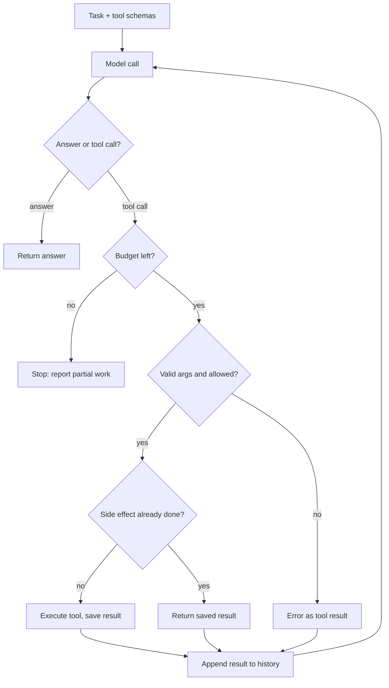

Every agent framework you've used has the same twenty lines at its core: call the model, run the tool it asked for, append the result, call it again. The other few thousand lines are there because those twenty fail in so many interesting ways.

In September, OpenAI made a bet that you'd rather not own those few thousand lines. Its Agents API runs the loop on OpenAI's side, the same Codex harness behind Codex itself, and your application sends work in and gets events back.

So this week has two parts. First, what the managed version takes off your plate and what it quietly keeps on it. Then the loop itself, the first pattern in this curriculum, built small enough that you can break it on purpose.

## Part A: This week's big model/feature change

### What changed

The [Agents API](https://developers.openai.com/api/docs/guides/agents-api/overview) went into public beta on 10 September 2026. At DevDay on 29 September, OpenAI [added computer use](https://developers.openai.com/api/docs/guides/agents-api/tools/computer-use) to it, so a session can drive a browser in a hosted environment. That's why it's the change to look at now: it has gone from "a hosted loop" to "a hosted loop with hands".

The docs put the split in one line: "OpenAI manages sessions, orchestration, context compaction, and recovery while your application provides tools and chooses its execution environment."

### How it works

Four nouns carry the design. An **agent** is the model, instructions, tools and MCP servers. An **environment** is optional compute: none, an OpenAI-hosted sandbox, or a self-hosted one where you run an executor process that the harness sends commands to. A **session** is a durable instance of the agent. **Events and items** are what goes in and comes out.

The tool flow is the part worth reading slowly. Remote MCP tools are called by the harness directly. Your own [function tools](https://developers.openai.com/api/docs/guides/agents-api/tools/functions) are not. When the agent wants one, the session emits `agent.session.requires_action`, your code runs the function and posts back a `tool_result` carrying the same `turn_id` and `call_id`, and the harness carries on. Results must be under 4 MiB.

Two features from inside the harness come along with it:

- **[Tool search](https://developers.openai.com/api/docs/guides/tools-tool-search).** Mark functions `defer_loading: true` and the model sees only names and descriptions up front, loading full schemas when it needs them. Loaded tools are appended at the end of the context so the cached prefix survives. MCP tools are deferred automatically in the Agents API.
- **[Compaction](https://developers.openai.com/api/docs/guides/compaction).** As a session nears its context limit, the harness summarises earlier work. The compaction item is encrypted and, in OpenAI's words, "not intended to be human-interpretable."

There's no separate Agents API fee. You pay for model tokens, built-in tools and hosted container time at standard rates.

### Architectural implications

**The loop moves, the side effects don't.** Your function handler is still a distributed-systems component. The docs say it plainly: if your handler is down, "the agent can remain waiting for a result." And on reconnects: "For functions with side effects, store results durably by session, turn, and call ID." That's an idempotency ledger, and you're still the one who has to build it.

**State now lives with the vendor, partly in a form you can't read.** Sessions are retained server-side. Compacted context is opaque. For a coding assistant that's fine. For a regulated workflow where someone will later ask "what did the agent know when it approved this?", an encrypted summary is an awkward answer. The [tracing](https://developers.openai.com/api/docs/guides/agents-api/tracing) export (OTLP JSON) helps, so check it captures what your auditors need.

**Data controls are a hard filter.** The overview states the API "currently supports data residency only in the United States and does not support Zero Data Retention (ZDR)", and that a self-hosted sandbox doesn't change that. For many enterprise teams this ends the evaluation before latency or quality come up.

**Recovery semantics are explicit, which is good.** The [errors guide](https://developers.openai.com/api/docs/guides/agents-api/errors) separates request, turn, session and environment failures, and its retry advice starts with "Check completed actions. A failed turn may already have changed files or called external tools." That one sentence is most of what goes wrong in home-grown loops.

### When to use it

It's a good fit when the agent is mostly tool calls plus code execution, the data can sit in US-resident, non-ZDR storage, and your team would otherwise spend a quarter rebuilding compaction, sandboxing and resumable sessions. Build-versus-buy here is mostly about which failure modes you want to own.

I'd keep the loop in-house when you need multiple model providers, when the audit trail must be fully readable, or when the loop is part of your product's differentiation (custom planning, domain-specific stopping rules). A thin loop you control is cheaper to reason about than a thick one you don't.

### What to verify before trusting the claims

- **Compaction quality on your tasks.** Run long sessions and check whether constraints from early turns survive. "Retains what the agent still needs" is a claim you can only test on your own workload.
- **Tool search hit rate.** The docs' own trade-off table notes that deferred loading "depends on finding the relevant tool." Log when the agent picks the wrong tool or none, and compare task completion, input tokens and latency against eager loading on representative requests. That's OpenAI's own advice, too.
- **Cost per completed task, not per token.** With no platform fee, the bill is tokens plus container time. Agent sessions can spiral, so measure end-to-end cost on real tasks, and use the session usage budget (there's a `session_budget_exceeded` turn error, so budgets exist).
- **Your handler's failure path.** Kill your function worker mid-turn and confirm you can resume without double-executing anything.

## Part B: Agentic pattern of the week: the agent loop and tool calling

### The problem

Some tasks can't be scripted ahead of time because the next step depends on what the last step found. Look up the order, and then it depends: refund, replace, escalate. A fixed pipeline either grows a branch for every case or gives up.

### The pattern

Let the model choose the next action, execute it, show it the result, repeat until it answers or you stop it. [ReAct](https://arxiv.org/abs/2210.03629) (Yao et al., 2022) gave this its name: interleave reasoning with actions so each informs the other. Anthropic's [Building effective agents](https://www.anthropic.com/engineering/building-effective-agents) puts the crucial bit well: the agent must "gain 'ground truth' from the environment at each step."

The model never runs anything. It emits a structured request. Your code decides whether to honour it, and everything interesting about a production loop happens in that gap.



Three choices in that diagram matter more than the rest:

1. **A hard step budget.** Plus a token or cost budget for long tasks. Without one, a confused model doesn't fail, it just keeps going.
2. **Errors go back to the model as results.** A `ValueError` that kills the process teaches nothing. The same error as a tool result ("refund would exceed order total") often lets the model correct itself on the next step.
3. **Side-effecting tools are idempotent.** Models repeat themselves, retries replay calls, and reconnects re-deliver. The ledger is what stops a double refund.

### Trade-offs

You're trading latency and cost for flexibility. Every step is a full model call over a growing context, so a ten-step task costs far more than ten times a one-shot call, because each call re-reads everything before it. Prompt caching softens this, which is why the tool-search design above works hard to keep the prefix stable.

Tool design is the biggest quality lever you control. Anthropic's advice is to treat the agent-computer interface with the care you'd give a human UI, and to make arguments hard to misuse. A `refund(order_id, amount)` that checks the order total is safer than a generic `update_order(fields)`.

### Failure modes

- **Runaway loops.** The model retries the same failing call forever. Budgets catch it, and repeated-call detection catches it sooner.
- **Duplicate side effects.** Covered above, and the most expensive failure on this list.
- **Context bloat.** Raw tool output (a 2 MB JSON blob, a full web page) floods the window and the model loses the thread. Trim or summarise results before appending them.
- **Silent wrong tool.** With many similar tools, the model picks a plausible wrong one and succeeds at the wrong thing. Fewer, sharper tools beat many overlapping ones.
- **Injected instructions in tool results.** A fetched page or email can say "ignore previous instructions." Anything a tool returns is untrusted data, so gate dangerous actions on policy in code, not on the model's judgement.

### When not to use it

If you can draw the flowchart before the request arrives, write the flowchart. Classification, extraction, single-shot RAG, and fixed multi-step pipelines are workflows, and they're cheaper, faster and far easier to test than a loop. Reach for the loop when the path genuinely depends on what the tools find.

Also skip it when one wrong action is unrecoverable and there's no human approval step. A loop with a `wire_transfer` tool and no gate is not something to ship.

### Try it in 10 minutes

No API key needed. The "model" below is scripted, so you can watch the loop's guards fire deterministically, then swap in a real model call later.

```python
import json

# A scripted "model": returns tool calls until it decides to answer.
# Swap this for a real API call later; the loop around it stays the same.
SCRIPT = [
    {"tool": "get_order", "args": {"order_id": "A-17"}},
    {"tool": "refund", "args": {"order_id": "A-17", "amount": 40}},
    {"tool": "refund", "args": {"order_id": "A-17", "amount": 40}},  # the model repeats itself
    {"answer": "Refunded 40 on order A-17."},
]

def fake_model(history):
    steps_taken = sum(1 for m in history if m["role"] == "tool")
    return SCRIPT[min(steps_taken, len(SCRIPT) - 1)]

ORDERS = {"A-17": {"total": 40, "refunded": 0}}
DONE = {}  # idempotency ledger: key -> saved result

def get_order(order_id):
    return ORDERS[order_id]

def refund(order_id, amount):
    o = ORDERS[order_id]
    if o["refunded"] + amount > o["total"]:
        raise ValueError(f"refund would exceed order total ({o['total']})")
    o["refunded"] += amount
    return {"ok": True, "refunded": o["refunded"]}

TOOLS = {"get_order": get_order, "refund": refund}
SIDE_EFFECTS = {"refund"}

def run(task, max_steps=6):
    history = [{"role": "user", "content": task}]
    for step in range(max_steps):
        out = fake_model(history)
        if "answer" in out:
            return out["answer"]
        name, args = out["tool"], out["args"]
        key = f"{name}:{json.dumps(args, sort_keys=True)}"
        if name in SIDE_EFFECTS and key in DONE:
            result = {"error": "already done", "previous": DONE[key]}
        else:
            try:
                result = TOOLS[name](**args)
                if name in SIDE_EFFECTS:
                    DONE[key] = result
            except Exception as e:  # errors go back to the model, not up the stack
                result = {"error": str(e)}
        print(f"step {step}: {name}({args}) -> {result}")
        history.append({"role": "tool", "name": name, "content": json.dumps(result)})
    return "stopped: step budget exhausted"

print(run("Customer says order A-17 arrived broken. Sort it out."))
```

Run it, then break it three ways:

1. **Remove the ledger check** (`and key in DONE` → `and False`). The second refund now hits the business rule instead. You were saved by `refund` validating its own input, so ask yourself how many of your real tools would do the same.
2. **Set `max_steps=2`.** You get "budget exhausted" with a refund already issued. What should the caller be told, and who finishes the job?
3. **Notice the key's weakness.** It's built from the arguments, so a legitimate second partial refund of the same amount would be blocked. Real systems key on the business operation (a refund request ID) or on the `call_id` the API hands you. Which would you choose, and why?

If you have an API key, swap `fake_model` for a real function-calling request and watch whether the model repeats itself unprompted. It happens more often than you'd think.

Didn't get to the code today? That's fine. The loop will still be here next time you sit down, and so will the bug it prevents.
