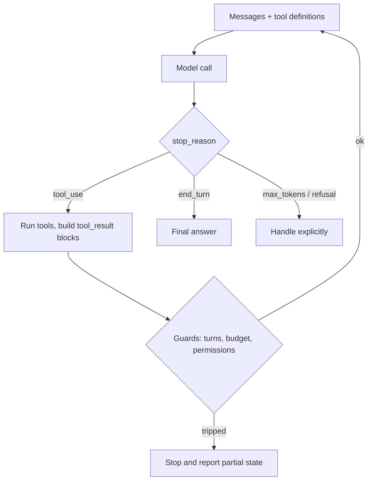

Google's own announcement of Gemini 4 Argon quotes an output limit of 1M tokens, up from 64K. Read that as an agent designer and the first reaction should be a small flinch: the ceiling on a single runaway turn just went up by a factor of fifteen or so.

Hold onto that flinch. It's the right instinct for the whole post, because the interesting part of "agents" is rarely the model. It's the loop wrapped around it, and who is allowed to stop that loop.

## Part A: What changed this week

**What Google announced (30 September 2026).** Gemini 4 Argon, positioned for long-horizon work: software engineering, knowledge work like legal and finance, and cyber defense. Per [Google's post](https://blog.google/innovation-and-ai/models-and-research/gemini-models/gemini-4-argon/):

- Access starts with vetted cyber defenders through the Fairwind program. Developers and enterprises follow, "starting with paid API customers and Google AI Ultra subscribers", with no date given.
- Introductory pricing is $2 per million input tokens and $10 per million output tokens, with cached input at a 95% discount. The post says the standard price after the introductory period is $4 and $20. It doesn't say when the intro period ends.
- Reported scores: DeepSWE v1.1 at 77.9%, CWE-bench v1 at 68%, AutomationBench at 51.3%, LVBench at 91.7%. The [9to5Google write-up](https://9to5google.com/2026/09/30/gemini-4-argon-announcement/) repeats the same numbers.
- Safety claims: adversarial training against prompt injection, chain-of-thought monitoring for misalignment, hardened sandboxes.

**What it means architecturally.** Not much, yet. Almost nobody reading this can call it today. What you can do now is plan for it:

- **Budget on the standard price, not the intro price.** If your unit economics only work at $2/$10, they don't work. Cached-input discounts reward stable prefixes, so keep tool definitions and system prompt byte-identical across turns.
- **Treat the output limit as a blast radius, not a feature.** Long outputs are useful for migrations and report generation. They are also how one bad turn costs real money. Set `max_tokens` per call to what the step needs, not to what the model allows.
- **Long-horizon means more loop iterations**, and each iteration re-sends the growing history. Output price isn't where agent bills usually come from; repeated input is.

**What to verify before trusting the claims.**

- Benchmark names are new, so check who runs them. A vendor-reported 77.9% on a vendor-chosen suite tells you the model is in the conversation, not that it fits your workload.
- Gray Swan's prompt-injection benchmark is named as a lead, but the post gives no score. "Leading" without a number is a prompt to run your own injection tests, not a result.
- The cyber-defender tier is described as running without cybersecurity guardrails. That's a different product from what a paid API customer will get, so don't extrapolate its behaviour to your tenant.

Short version: interesting model, nothing to redesign this week, one budget assumption to write down.

## Part B: Agentic pattern of the week — the agent loop and tool calling

Everything in the curriculum ahead sits on this. So let's make sure the foundation is solid.

**The problem.** The model can't do anything. It emits text. If you want a database query run or a ticket filed, something outside the model has to do it and report back.

**The pattern.** [Anthropic's tool-use docs](https://platform.claude.com/docs/en/agents-and-tools/tool-use/how-tool-use-works) put it plainly: the model never executes anything. It emits a structured request, your code runs it, and the result goes back into the conversation. The canonical shape is a `while` loop on `stop_reason`:

The exit conditions are the part people skip. The loop continues only on `tool_use`; `end_turn`, `max_tokens`, `stop_sequence` and `refusal` all end it, and each needs a decision from you. A `max_tokens` stop mid-tool-call, for instance, is a truncated request, not an answer.

Anthropic's Agent SDK documents the same loop with the guards built in: `max_turns` caps tool-use round trips, `max_budget_usd` caps spend (subagent spend included). Hitting either returns a result with subtype `error_max_turns` or `error_max_budget_usd`. Both default to no limit ([source](https://code.claude.com/docs/en/agent-sdk/agent-loop)). That default is fine for a demo and wrong for production.

Other mechanics worth knowing:

- **Parallel calls.** A turn can request several tools. Read-only ones can run concurrently; anything that mutates state should run sequentially. Custom tools default to sequential, and you opt in with a read-only hint.
- **Server vs client tools.** Server tools like web search run inside the provider's own loop, which has an iteration cap. When it's hit you get `pause_turn`, and you re-send to continue. Your loop must handle that stop reason or it will treat a paused turn as finished.
- **Overhead.** Tool use adds a hidden system prompt. For Opus 5.5 and Sonnet 5.5 the docs list 286 tokens, plus whatever your schemas cost. Small, but multiplied by every turn.

**Trade-offs.**

- Each turn is a full model round trip. Five sequential tool calls is five latencies; ask for parallel calls where they're independent.
- Tool results are the main source of context growth. A verbose `Bash` or `Read` output costs input tokens on every later turn. Truncate or summarise at the tool boundary, not in the prompt.
- Better tool descriptions beat better prompts. Anthropic's [Building effective agents](https://www.anthropic.com/engineering/building-effective-agents) argues tools deserve as much design effort as prompts: clear parameters, examples, and formats that avoid string-escaping and counting.

**Failure modes.**

- **Runaway loops.** Model retries the same failing call. Cap turns, and detect repeated identical calls.
- **Silent truncation.** `max_tokens` hit mid-JSON. Check stop reason before parsing.
- **Unbounded results.** One 200 KB tool result poisons the rest of the session.
- **Permission drift.** A tool added for one task is still there for the next. Allow-list per run.

**When NOT to use it.** If the steps are known in advance, write a workflow: fixed code path, model calls at defined points. The same Anthropic piece is blunt that agents bring "higher costs, and the potential for compounding errors", and that single, well-fed LLM calls are often enough. We'll draw that line properly in a later post.

### Try it (10 minutes)

Build the smallest honest loop, without a framework.

1. Define two tools: `read_file(path)` and `list_dir(path)`.
2. Write the `while stop_reason == "tool_use"` loop yourself.
3. Add three guards: `max_turns = 8`, a running token counter that aborts at a budget you pick, and a result-size cap that truncates any tool output over 4,000 characters.
4. Ask it to summarise a repo. Then ask something it can't answer and watch which guard fires first.
5. Log, per turn: input tokens, output tokens, tools called. You'll see the input column climb. That column is your agent bill.

If nothing else, you'll know exactly what a framework is hiding from you.

Done beats perfect here, and a day you skip is just a day you skip. The loop will still be there.
