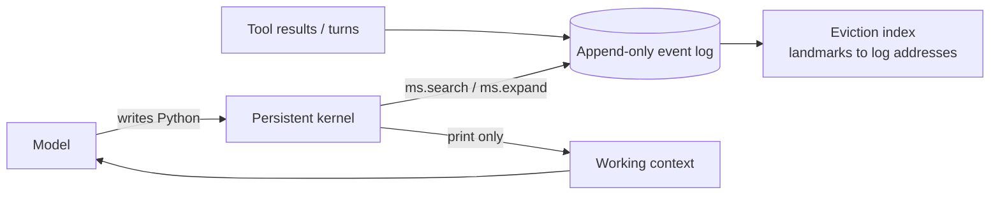

Most agent memory systems make one decision early and live with it forever: at write time, they decide what's worth keeping. Summarize, extract facts, embed chunks. Whatever the summarizer dropped is gone, and you find out when a user asks about the one detail it thought was boring.

"Context as an Environment" (Lin, Ang, Zhu, Ding, Zhou, arXiv 2608.21690, August 2026) argues for the opposite. Keep everything, losslessly, and let the model decide what to look at when the question arrives. The system is called Scroll.

## The problem

A long-horizon agent produces more history than any window can hold. The usual answers each pay a tax:

- **Summarize or compact:** cheap at read time, lossy forever. Exact values (a figure, an ID, an earlier version of a fact) are the first casualties.
- **Retrieve (RAG over history):** keeps the raw data, but the retrieval query is a guess made before the model knows what it needs, and intermediate computation still has to be serialized back into the prompt as text.

Both treat context as something you *build for* the model. Scroll treats it as something the model *builds itself*.

## The core idea

Each agent session becomes an executable environment with three parts:

1. **An append-only event log** (SQLite-backed, immutable, every event has a sequence address). Nothing is ever rewritten.
2. **Payload storage.** Small results stay inline; large tool outputs go to the filesystem behind lazy handles.
3. **A persistent Python kernel.** Variables survive across model calls, so a tool result can live as a Python object instead of being pasted back as text.

The model reads its own history through four operations: `ms.search()` (BM25-ranked query over the log), `ms.expand()` (materialize exact records), arbitrary Python in the kernel, and `print()`. Only what gets printed enters the next prompt. The context window is a view the model writes a query for, not a transcript.

## Eviction without forgetting

When the working view exceeds its budget, Scroll evicts: it protects the active turns and recent tail, folds completed tool payloads down to sequence pointers first, then drops the oldest completed spans. The evicted content stays intact in the log. An eviction index keeps compact landmarks (task, state, action, status headlines) tied to exact log addresses, using O(k log_k n) space, so the model can navigate back to a region instead of full-text searching for it.

The difference from compaction is that eviction here is reversible. Your window shrinks; your evidence doesn't.

## What the results say

The authors report, using Qwen3.8-Max as the main backbone:

- **LongMemEval_S:** 94.8%
- **BEAM_10M** (10M-token histories): 73.1%, versus 68.0% for the prior best they compare against. Median input is about 105K tokens, roughly 1% of the corpus.
- **LOCA** (long-horizon acting): 89.3% at 128K and 86.7% at 256K, versus 49.3% for the prior best at 256K.

The ablations are the more interesting part. Removing the lossless log collapses BEAM_10M to 19.9. Removing the persistent kernel costs 7.3 points, mostly on tasks that need composing results. Removing the eviction index costs only 1.8. So the big wins come from *losslessness plus programmability*; the clever index is a refinement.

Treat all of this as author-reported, with their harness, on their chosen benchmarks. The 49.3 → 86.7 gap on LOCA is large enough that I'd want to see it reproduced independently before building on it. I couldn't verify a public code repository from the paper page, so check that before planning around it.

## Why it works

Two reasons, and they're separable.

**Decisions move to query time.** A summary is a guess about future questions. A log plus a query tool lets the model answer with the actual question in hand. That's why it wins on knowledge updates, contradictions and exact extraction.

**Intermediate state stops costing tokens.** In a ReAct-style loop, every intermediate result you want to reuse gets re-serialized into the prompt. In a kernel it's a variable. Aggregations over many records are where this shows up.

## The architectural implication

Read it as a design pattern more than a system to adopt: **separate the store of record from the working context, and give the model a programmable path between them.** If you've already built an event-sourced agent runtime for durable execution, you're halfway there. The log you keep for replay can also be the log the model reads.

The costs are real, though:

- **You're running model-written code.** The kernel needs the same sandboxing, resource limits and secrets hygiene as any code-execution tool. A prompt injection sitting in the log can now be *executed against*, not just read.
- **It needs a strong model.** The authors tested six backbones; weaker ones failed with execution errors or quit early on complex aggregations. Capability scales the benefit.
- **Latency.** Extra turns writing and running queries instead of one prompt. The paper reports tokens, so measure wall-clock yourself.
- **Where it loses.** Per the authors, summarization-heavy and preference-following tasks do worse, because the system reconstructs per query where an ingestion-time digest would just hand over the gist. Multi-session reasoning is also weak across all systems (9.6 to 26.1).

## The one thing worth understanding

Forget the benchmarks and keep the interface: *search, expand, compute, print*. Four verbs. The model's whole relationship with its past is code that ends in a `print`. Everything else (the log, the index, the eviction) exists to make that cheap and lossless.

If you're choosing between memory designs, the useful question is what your agent gets wrong today: lost exact details (try this pattern), or loss of gist and preferences (keep your summaries, maybe add this beneath them).

## Try it in 45 minutes

Take an agent loop you already run. Log every tool call and result to SQLite with an autoincrement ID. Give the model two tools, `search(query)` (FTS5 gets you BM25) and `expand(id)`, and cap the prompt history at a few thousand tokens. Ask it questions about something from fifty turns ago. Then compare against your current summarizer on questions that need an exact value. You'll learn quickly which kind of memory your use case needs.

Paper: [arXiv 2608.21690](https://arxiv.org/abs/2608.21690). Code: not confirmed from the paper page at time of writing.

Skim it, skip it, or come back next week; the log will still be there.
