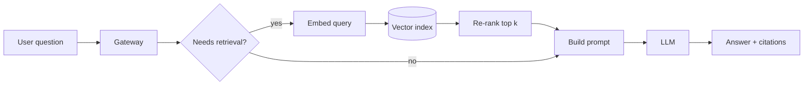

> **This is an example post.** It only exists so you can see the layout. Delete the
> `src/content/dives/system/2026-10-01-example.md` file when the first real deep dive is published.

Most retrieval-augmented generation (RAG) diagrams show three boxes and an arrow. Real requests take a few more turns, and each one is a place where latency or quality can leak.

## The path of one request



## Trade-offs to notice

- **Re-ranking** adds 50–200 ms but often fixes more answers than a bigger model would.
- **Skipping retrieval** for simple questions saves cost, but the router itself can be wrong.

## A small exercise

Sketch this flow for a system you know. Where would you put the cache?

```python
def answer(question: str) -> str:
    docs = retrieve(question, k=20)
    top = rerank(question, docs)[:5]
    return llm(build_prompt(question, top))
```

Not today? Bookmark it. The diagram will still be here.
