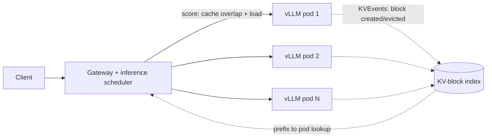

Prefix caching is one of the cheapest wins in LLM serving. Reuse the KV blocks for a shared system prompt and you skip most of the prefill work. On one replica, it just works.

Then you scale to eight replicas behind a standard load balancer, and the win mostly evaporates. Each replica keeps its own cache in isolation, and the balancer has no idea what any of them holds.

That's the whole topic. The interesting part is how much it costs, and what it takes to fix it.

## The failure mode

A conventional balancer optimises for even load: round-robin, least-connections, maybe queue depth. For stateless services that's correct. LLM replicas aren't stateless. A request whose 6,000-token prefix is already cached on pod 3 costs a fraction of the same request landing on pod 5.

So the balancer is making a placement decision with the most important variable hidden. Worse, it's self-defeating: when every pod sees every prefix, every pod caches every prefix, and the fleet's cache holds eight copies of the hot set instead of one copy of a much larger set. Cache churn goes up, hit rate goes down.

## What llm-d does about it

[llm-d](https://github.com/llm-d/llm-d) is a Kubernetes-native distributed inference stack founded by Red Hat, Google Cloud, IBM Research, CoreWeave and NVIDIA, and listed as a CNCF Sandbox project since March 2026. Its scheduler sits behind the Gateway API Inference Extension and scores each candidate pod per request.

Three levels of cache awareness are worth separating:

1. **Load-aware only.** Queue depth and cache utilisation. Blind to prefixes.
2. **Approximate prefix scoring.** The scheduler remembers where it sent similar prefixes and assumes those pods still hold them. Cheap, no extra plumbing, and wrong whenever a pod evicted something.
3. **Precise prefix scoring.** Each vLLM pod streams `KVEvents` whenever a cache block is created or evicted. A scheduler-side index (the `llm-d-kv-cache` library) maps block hashes to pods, so the router scores against what's actually resident.

The index is small. The llm-d post gives a DeepSeek R1 example where about 365 GB of cluster KV cache is tracked in roughly 339 KB of scheduler memory. Metadata isn't the cost here; the cost is operating one more stateful, eventually consistent component on the request path.

## The case study: numbers, with caveats

The llm-d team published a benchmark, [KV-Cache Wins You Can See](https://llm-d.ai/blog/kvcache-wins-you-can-see). The setup:

- Qwen 32B-class model on 8 vLLM pods, 2 H100s each (16 GPUs).
- 150 customer groups, each with a shared 6,000-token context, 5 concurrent users per group sending 1,200-token queries.
- Poisson arrivals ramped from 3 to 60 QPS.
- Total cache demand about 73% of cluster capacity, around 6x one pod's cache.

That last point matters. It's a workload designed so no single pod can hold everything, which is exactly where placement counts.

| Strategy | Output tok/s | TTFT p90 (s) | TTFT mean (s) |
|---|---|---|---|
| Precise | 8730 | 0.542 | 0.298 |
| Approximate | 6944 | 31.1 | 13.3 |
| Load-aware | 4429 | 94.9 | 47.0 |
| Random | 4429 | 92.6 | 45.3 |

The authors' headline is p90 TTFT 57x better than approximate scheduling, and roughly double the throughput of the cache-blind strategies.

Read it like a vendor-adjacent benchmark, because it is one. It's a synthetic workload that suits the technique: heavy shared prefixes, many tenants, capacity pressure. The post itself notes it doesn't cover RAG, where retrieved documents arrive in different orders and break prefix matches. Also note the load-aware and random rows show identical throughput, so I'd treat that column as saturation-limited rather than meaningful.

What would need checking on your traffic: your real shared-prefix ratio, how far the fleet is from cache capacity, and whether your TTFT is dominated by prefill at all.

## Trade-offs to design for

- **Affinity versus load.** Pure cache affinity creates hot pods. The scorer has to blend both, and the weights are a tuning knob you now own.
- **Index staleness.** Events lag reality. A stale entry sends a request to a pod that has evicted the prefix: you pay a miss, not an error. Fine, but measure it.
- **Event stream as a dependency.** It couples scheduler and engine versions. A vLLM upgrade that changes block hashing can silently zero your hit rate.
- **Prompt discipline moves up the stack.** Routing can only find prefixes that exist. Timestamps, user IDs or reordered tool lists early in the prompt break matching no matter how clever the router is.
- **Autoscaling interacts.** A new pod starts cold, and scale-in throws away cache. Cache-aware routing plus aggressive scaling can fight itself.

## Numbers to remember

- Cached input tokens are commonly priced about 10x lower than uncached ones at hosted providers; check your own provider's page, since ratios differ.
- Cache hit rate is a fleet-level SLO metric, not a debugging detail. Track it per tenant.
- Expect the gain to scale with (shared-prefix tokens / total prompt tokens) and with how oversubscribed the fleet's cache is.

## How to explain it to a CTO in 3 sentences

Our GPUs remember the shared part of a prompt, but a normal load balancer scatters requests so they rarely land where that memory lives. Routing on what each GPU actually has cached cuts first-token latency and lets the same hardware serve more traffic, as long as our prompts share long prefixes. It adds one more moving part, so we should first measure how much of our traffic is actually shareable.

## Try it (37 minutes)

1. Take a day of your real prompt logs. Hash 16-token blocks of each prompt, and compute the fraction of tokens that appear as a prefix of an earlier request within 10 minutes. That's your ceiling.
2. Simulate two routers on the same log with eight simulated pods, each an LRU of N blocks: round-robin versus "send to the pod with the longest matching prefix, break ties by least load."
3. Compare simulated hit rates as you shrink N. If the gap is small at realistic N, skip the whole project.

If the numbers come out dull, you've saved yourself a quarter of platform work; if they don't, you've got your business case. Either way, a rough simulation today beats a perfect one next month.
